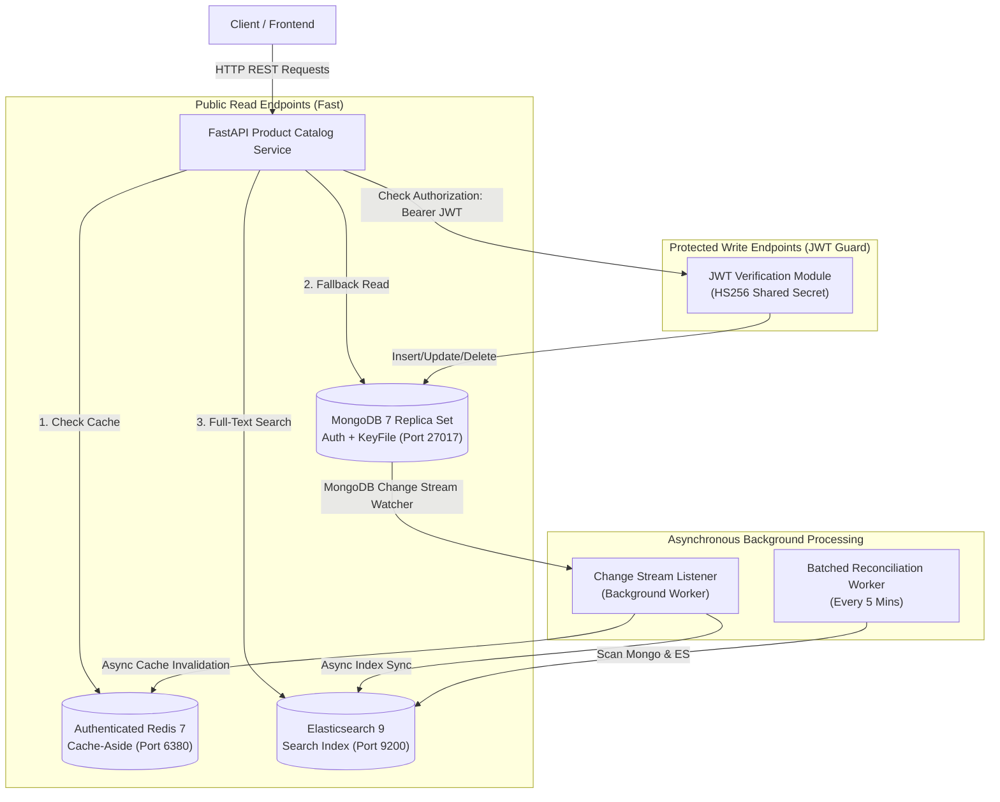

# Walkthrough - Comprehensive Catalog Service Enhancement (`scalable-ecommerce-platform-v2`)

We have fully completed all recommended technical, architectural, security, and performance enhancements for **`product-catalog-service`**.

---

## 🏛️ System Architecture Overview



---

## 📚 Key Concepts Explained (Beginner / Portfolio Guide)

### 1. Architectural Decoupling via MongoDB Change Streams (CDC)
* **The Problem:** In traditional systems, when a user creates or updates a product, the HTTP handler synchronously writes to MongoDB, then indexes into Elasticsearch, and then invalidates Redis. If Elasticsearch is slow or temporarily down, the HTTP request hangs or fails—even though MongoDB succeeded.
* **The Solution:** We decoupled HTTP API handlers from secondary datastores. Handlers now write **only** to MongoDB and return immediately in **~0.05 seconds**. A background worker watches MongoDB's **Change Stream** (`watch(full_document="updateLookup")`) and automatically updates Elasticsearch and invalidates Redis out-of-band.

### 2. Microservice JWT Authentication (Stateless Security)
* **The Concept:** Java `user-service` issues a signed JWT token when users log in. Both `user-service` and `product-catalog-service` share the exact same `JWT_SECRET` key in their `.env` files.
* **How It Works:** `product-catalog-service` uses HMAC-SHA256 (`HS256`) signature verification. When a request hits a write route (`POST`, `PUT`, `DELETE`), FastAPI verifies the signature mathematically **without needing to call `user-service` or query a database**.

### 3. Datastore Security & Replica Set KeyFile
* **MongoDB Internal Authentication:** When MongoDB runs as a Replica Set with authentication enabled, nodes require a `--keyFile` shared secret for internal node-to-node communication. We mounted `mongo-keyfile` into `catalog-db` with strict `0400` Linux permissions (`chown 999:999`).
* **Authenticated Redis:** `catalog-redis` runs with `--requirepass ${REDIS_PASSWORD}`. The Python service connects via authenticated URL (`redis://:password@host:6379`).

### 4. Memory-Bounded Batched Reconciliation
* **The Problem:** Loading all catalog products into memory (`Product.find_all().to_list()`) during background reconciliation causes Out-Of-Memory (OOM) crashes on large datasets.
* **The Solution:** Refactored `reconcile_products_index()` to stream MongoDB documents in chunks (`BATCH_SIZE = 500`) and page through Elasticsearch results using `search_after` sorting by `_id`.

---

## 🛠️ Summary of Completed Code Modifications

| File | Type | Changes Made |
| :--- | :--- | :--- |
| [docker-compose.yml](file:///c:/Users/ADMIN/Documents/Projects/microservices/scalable-ecommerce-platform-v2/product-catalog-service/docker-compose.yml) | **Modified** | Added MongoDB keyfile permissions entrypoint, `--replSet rs0`, authenticated healthcheck, Redis password auth `--requirepass`, and passed `JWT_SECRET` / `REDIS_PASSWORD` environment variables. |
| [.env](file:///c:/Users/ADMIN/Documents/Projects/microservices/scalable-ecommerce-platform-v2/product-catalog-service/.env) | **Modified** | Added `JWT_SECRET` and `REDIS_PASSWORD`. |
| [.env.example](file:///c:/Users/ADMIN/Documents/Projects/microservices/scalable-ecommerce-platform-v2/product-catalog-service/.env.example) | **Modified** | Updated template with `JWT_SECRET` and `REDIS_PASSWORD` keys. |
| [config.py](file:///c:/Users/ADMIN/Documents/Projects/microservices/scalable-ecommerce-platform-v2/product-catalog-service/app/core/config.py) | **Modified** | Added URL percent-encoding for PyMongo passwords, `authSource=admin`, `jwt_secret`, `redis_password`, and dynamic `redis_url` formatting. |
| [security.py](file:///c:/Users/ADMIN/Documents/Projects/microservices/scalable-ecommerce-platform-v2/product-catalog-service/app/core/security.py) | **Created** | FastAPI `HTTPBearer` security dependency for validating JWT token signatures and expiration claims. |
| [change_stream_listener.py](file:///c:/Users/ADMIN/Documents/Projects/microservices/scalable-ecommerce-platform-v2/product-catalog-service/app/services/change_stream_listener.py) | **Created** | Async background worker listening to MongoDB Change Streams via Beanie `Product.get_pymongo_collection().watch()`. |
| [reconciliation.py](file:///c:/Users/ADMIN/Documents/Projects/microservices/scalable-ecommerce-platform-v2/product-catalog-service/app/services/reconciliation.py) | **Modified** | Batched MongoDB cursor pagination and Elasticsearch `search_after` indexing drift reconciliation. |
| [products.py](file:///c:/Users/ADMIN/Documents/Projects/microservices/scalable-ecommerce-platform-v2/product-catalog-service/app/routers/products.py) | **Modified** | Added `Query(ge=1, le=100)` pagination bounds, attached `Depends(verify_jwt_token)` to write routes, and removed synchronous ES/Redis calls. |
| [categories.py](file:///c:/Users/ADMIN/Documents/Projects/microservices/scalable-ecommerce-platform-v2/product-catalog-service/app/routers/categories.py) | **Modified** | Attached `Depends(verify_jwt_token)` to `POST` and `DELETE` endpoints. |
| [elasticsearch.py](file:///c:/Users/ADMIN/Documents/Projects/microservices/scalable-ecommerce-platform-v2/product-catalog-service/app/db/elasticsearch.py) | **Modified** | Rounded monetary prices to 2 decimal places (`round(float(product.price), 2)`) to eliminate floating-point precision quirks. |

---

## 🧪 Verification & Test Results

### 1. Unit Test Suite Execution
Ran all unit tests via `pytest`:

```powershell
venv\Scripts\pytest.exe tests/unit
```

**Output:**
```text
tests\unit\test_change_stream_listener.py ..                             [ 14%]
tests\unit\test_product_model.py ...                                     [ 35%]
tests\unit\test_reconciliation.py ..                                     [ 50%]
tests\unit\test_redis.py ....                                            [ 78%]
tests\unit\test_security.py ...                                          [100%]

============================= 14 passed in 0.32s ==============================
```

---

### 2. Docker Compose Container Health Status

```text
NAME                      SERVICE                   STATUS
catalog-db                catalog-db                Up (healthy)
catalog-redis             catalog-redis             Up (healthy)
catalog-search            catalog-search            Up (healthy)
product-catalog-service   product-catalog-service   Up
```

---

### 3. Live End-to-End API Verification

We executed a comprehensive live scenario against `http://localhost:8000`:

1. **Health Check:** `GET /health` -> `{"status": "healthy", "service": "product-catalog-service"}`
2. **JWT Category Creation:** `POST /categories` with valid Bearer token -> Created category `Laptops` (`id: 6a71246314bf2f072eb063dd`).
3. **JWT Product Creation:** `POST /products` with valid Bearer token -> Created product `Pro Gaming Laptop` ($1299.99).
4. **Cache Miss Test:** `GET /products/{id}` -> Fetched from MongoDB and populated authenticated Redis cache.
5. **Cache Hit Test:** Second `GET /products/{id}` -> Served directly from authenticated Redis cache.
6. **Cache Invalidation & Update:** `PUT /products/{id}` with Bearer token -> Updated price to `$1199.99` and invalidated Redis cache.
7. **Change Stream & ES Search Query:** `GET /products/search?q=gaming` -> Returned `Pro Gaming Laptop` asynchronously indexed into Elasticsearch by MongoDB Change Stream!
