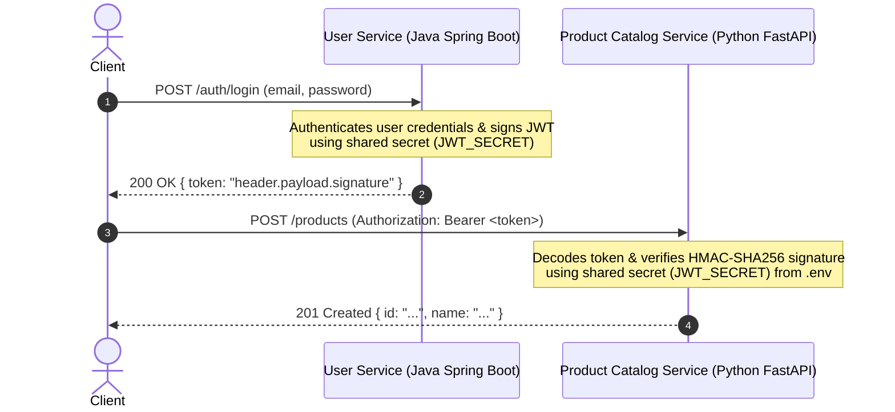

# Walkthrough - Task 3: Security & Infrastructure Hardening (JWT Authentication Middleware)

We have successfully implemented **JWT Authentication Middleware** for `product-catalog-service` inside `scalable-ecommerce-platform-v2`. This document provides a detail-oriented, step-by-step breakdown of the architecture, code implementation, and live verification results for learning and portfolio reference.

---

## 📚 Architectural Deep-Dive: Cross-Service JWT Verification

In a polyglot microservices architecture (Java Spring Boot + Python FastAPI), **stateless authentication via JSON Web Tokens (JWT)** allows services to independently verify user identities without making cross-service network calls or database lookups for every HTTP request.



### Why Stateless JWT Verification Matters for Portfolio Architecture:
1. **Zero Database Latency:** The receiving service (`product-catalog-service`) does not need to query a user database to verify request authenticity.
2. **Cryptographic Trust:** HMAC-SHA256 (`HS256`) guarantees that if a token was modified or signed by an untrusted party, verification fails immediately.
3. **Decoupled Technology Stacks:** `user-service` uses `io.jsonwebtoken` (Java), while `product-catalog-service` uses `PyJWT` (Python). Both share the same secret key and cryptographic algorithm.

---

## 🛠️ Step-by-Step Implementation Details

### 1. Environment & Container Configuration
Added `JWT_SECRET` to the environment configuration files so it is managed securely across local development and Docker Compose container deployments.

* **[.env](file:///c:/Users/ADMIN/Documents/Projects/microservices/scalable-ecommerce-platform-v2/product-catalog-service/.env)** & **[.env.example](file:///c:/Users/ADMIN/Documents/Projects/microservices/scalable-ecommerce-platform-v2/product-catalog-service/.env.example)**:
  ```ini
  JWT_SECRET=supersecret_jwt_key_for_scalable_ecommerce_platform_2026
  ```

* **[docker-compose.yml](file:///c:/Users/ADMIN/Documents/Projects/microservices/scalable-ecommerce-platform-v2/product-catalog-service/docker-compose.yml)**:
  ```yaml
  product-catalog-service:
    environment:
      ...
      JWT_SECRET: ${JWT_SECRET}
  ```

* **[config.py](file:///c:/Users/ADMIN/Documents/Projects/microservices/scalable-ecommerce-platform-v2/product-catalog-service/app/core/config.py)**:
  ```python
  class Settings(BaseSettings):
      ...
      jwt_secret: str = "supersecret_jwt_key_for_scalable_ecommerce_platform_2026"
      jwt_algorithm: str = "HS256"
  ```

---

### 2. Core Security Module: `verify_jwt_token`
Created [security.py](file:///c:/Users/ADMIN/Documents/Projects/microservices/scalable-ecommerce-platform-v2/product-catalog-service/app/core/security.py) implementing a FastAPI security dependency using `HTTPBearer`.

```python
from fastapi import Depends, HTTPException, status
from fastapi.security import HTTPAuthorizationCredentials, HTTPBearer
import jwt
from app.core.config import settings

security = HTTPBearer()

def verify_jwt_token(credentials: HTTPAuthorizationCredentials = Depends(security)) -> dict:
    """
    Validates incoming Bearer JWT tokens.
    Verifies signature using shared JWT_SECRET and checks expiration.
    """
    token = credentials.credentials
    try:
        payload = jwt.decode(token, settings.jwt_secret, algorithms=[settings.jwt_algorithm])
        return payload
    except jwt.ExpiredSignatureError:
        raise HTTPException(
            status_code=status.HTTP_401_UNAUTHORIZED,
            detail="Token has expired",
            headers={"WWW-Authenticate": "Bearer"},
        )
    except jwt.InvalidTokenError:
        raise HTTPException(
            status_code=status.HTTP_401_UNAUTHORIZED,
            detail="Invalid authentication token",
            headers={"WWW-Authenticate": "Bearer"},
        )
```

---

### 3. Router Endpoint Protection Matrix

| Method | Endpoint | Access Level | Security Requirement |
| :--- | :--- | :--- | :--- |
| `GET` | `/products` | **Public** | None (Fast client browsing) |
| `GET` | `/products/{id}` | **Public** | None |
| `GET` | `/products/search` | **Public** | None |
| `GET` | `/categories` | **Public** | None |
| `GET` | `/health` | **Public** | None |
| `POST` | `/products` | **Protected** | `Authorization: Bearer <valid_jwt>` |
| `PUT` | `/products/{id}` | **Protected** | `Authorization: Bearer <valid_jwt>` |
| `DELETE`| `/products/{id}` | **Protected** | `Authorization: Bearer <valid_jwt>` |
| `PATCH` | `/products/{id}/stock` | **Protected** | `Authorization: Bearer <valid_jwt>` |
| `POST` | `/categories` | **Protected** | `Authorization: Bearer <valid_jwt>` |
| `DELETE`| `/categories/{id}` | **Protected** | `Authorization: Bearer <valid_jwt>` |

---

## 🧪 Verification & Test Results

### 1. Automated Unit Tests
Ran unit tests including [test_security.py](file:///c:/Users/ADMIN/Documents/Projects/microservices/scalable-ecommerce-platform-v2/product-catalog-service/tests/unit/test_security.py):

```powershell
venv\Scripts\pytest.exe tests/unit
```

**Output:**
```text
tests\unit\test_change_stream_listener.py ..                             [ 20%]
tests\unit\test_product_model.py ...                                     [ 50%]
tests\unit\test_reconciliation.py ..                                     [ 70%]
tests\unit\test_security.py ...                                          [100%]

============================= 10 passed in 0.41s ==============================
```

---

### 2. Live HTTP API Authentication Tests

We executed live requests against the containerized FastAPI service running on `http://localhost:8000`:

#### Test 1: Unauthenticated Request (No `Authorization` Header)
```bash
POST http://localhost:8000/categories
```
**Response:** `HTTP 401 Unauthorized` (`{"detail": "Not authenticated"}`)

---

#### Test 2: Invalid Bearer Token (Tampered/Fake Secret Signature)
```bash
POST http://localhost:8000/categories
Header: Authorization: Bearer invalid_token_12345
```
**Response:** `HTTP 401 Unauthorized` (`{"detail": "Invalid authentication token"}`)

---

#### Test 3: Valid Bearer Token (Signed with `JWT_SECRET`)
```python
token = jwt.encode({"sub": "admin@ecommerce.com", "role": "ROLE_ADMIN"}, JWT_SECRET, algorithm="HS256")
```
```bash
POST http://localhost:8000/categories
Header: Authorization: Bearer <token>
Body: {"name": "Books", "description": "Novels"}
```
**Response:** `HTTP 201 Created`
```json
{
  "id": "6a6eaf572b2375670ecdadf2",
  "name": "Books",
  "description": "Novels"
}
```

---

#### Test 4: Public Browsing Request
```bash
GET http://localhost:8000/products
```
**Response:** `HTTP 200 OK` (Public catalog browsing remains fast and uninhibited).
