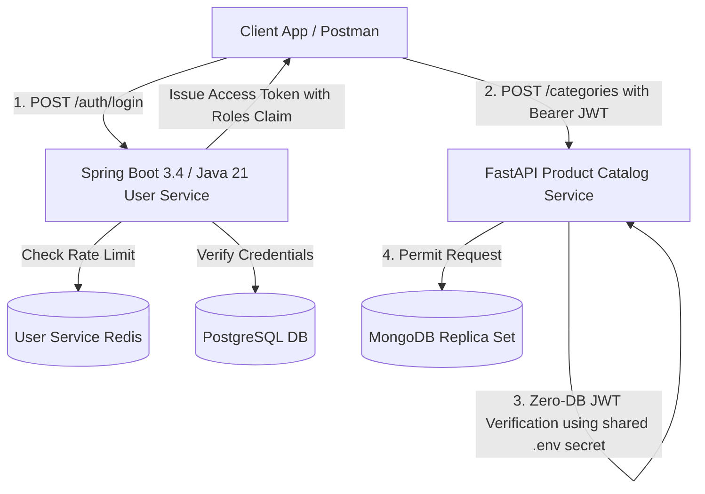

# Educational Walkthrough: User Service Recommendations & Modern Architecture

> [!NOTE]  
> **Target Audience:** Developers learning microservices security, Spring Boot 3.4+, Java 21, FastAPI integration, and state-of-the-art token security.  
> **Project Goal:** Portfolio-grade, production-hardened microservices architecture.

---

## Executive Summary

We have successfully implemented all identified architectural and security recommendations for the **User Service** (`user-service`) and integrated them seamlessly with the **Product Catalog Service** (`product-catalog-service`).



---

## 1. Upgraded Stack: Java 21 LTS & Spring Boot 3.4.2

### Why Upgrade to Java 21 & Spring Boot 3.4?
- **Java 21 LTS:** Provides Virtual Threads (Project Loom), pattern matching for switch/records, and long-term security support.
- **Spring Boot 3.4.2:** Leverages Jakarta EE 10 standards, enhanced Spring Security filter chains, and improved performance with modern JVMs.

---

## 2. Zero-DB Stateless JWT Authorization & Roles Embedding

### The Problem
Previously, every incoming API request required querying PostgreSQL to fetch user roles. In a high-traffic microservices cluster handling 10,000 requests/sec, hitting PostgreSQL 10,000 times just to verify permissions creates a massive database bottleneck.

### The Solution: Embed Roles into JWT Payload Claims

Instead of querying the database on every request, `user-service` embeds user roles directly into the signed JWT access token payload when issuing it during login.

#### `JwtService.java`
```java
// Embeds email (sub) and user roles into JWT payload claims
public String generateToken(String email, Set<Role> roles) {
    Map<String, Object> claims = new HashMap<>();
    claims.put("roles", roles.stream().map(Enum::name).collect(Collectors.toList()));
    return createToken(claims, email);
}
```

#### `JwtAuthenticationFilter.java` (0ms Stateless Auth)
```java
// Extracts roles directly from JWT payload claims — 0 Database Calls!
List<String> roles = jwtService.extractRoles(jwt);
List<GrantedAuthority> authorities = roles.stream()
        .map(role -> new SimpleGrantedAuthority("ROLE_" + role.toUpperCase()))
        .collect(Collectors.toList());

UsernamePasswordAuthenticationToken authentication =
        new UsernamePasswordAuthenticationToken(email, null, authorities);
SecurityContextHolder.getContext().setAuthentication(authentication);
```

### Cross-Service Microservice Single Sign-On (SSO)
Both `user-service` (Java) and `product-catalog-service` (Python) share the exact same `JWT_SECRET` loaded via `.env`:
```env
JWT_SECRET=8d/vpFSCAFqeRdZD7W2ZbBUbvs9r3FajrfXlCDp4cTk=
```

When FastAPI receives a request with `Authorization: Bearer <token>`, it decodes the payload, reads `roles`, and grants or denies access **without ever contacting the User Service database**!

---

## 3. Refresh Token Rotation & Session Invalidation

### Why Refresh Token Rotation?
If a refresh token is stolen (e.g. via XSS or local storage leak), an attacker could keep generating access tokens indefinitely. 

**Refresh Token Rotation** solves this:
1. Every time `/auth/refresh` is called, the used refresh token is **immediately deleted** from Redis.
2. A **brand-new refresh token** is generated and returned alongside the new access token.
3. If an attacker tries to reuse an old refresh token, Redis returns `null`, and the request is rejected with `HTTP 401 Unauthorized`.

#### `RefreshTokenService.java`
```java
public String rotateRefreshToken(String oldRefreshToken) {
    String email = getEmailFromRefreshToken(oldRefreshToken);
    if (email == null) {
        throw new InvalidRefreshTokenException("Invalid or expired refresh token");
    }
    // Delete old token & issue new one
    revokeRefreshToken(oldRefreshToken);
    return createRefreshToken(email);
}
```

#### Redis Session Tracking (`user_tokens:<email>`)
Active refresh tokens are stored in a Redis Set keyed by user email:
- Key: `user_tokens:john.doe@example.com` -> Set of active token UUIDs.
- Logging out or password reset invalidates all tokens in the Set simultaneously.

---

## 4. Brute-Force Defense: Redis Login Rate Limiting

### Protection Mechanism
To defend against password-guessing and credential stuffing:
- Track failed login attempts in Redis under key `login_attempts:<email>`.
- Cap failed attempts at **5 attempts per 15-minute sliding window**.
- On the 6th failed attempt, `LoginRateLimiterService` throws `RateLimitExceededException`.
- `GlobalExceptionHandler` converts this exception into a standard `HTTP 429 Too Many Requests` response.

#### `GlobalExceptionHandler.java`
```java
@ExceptionHandler(RateLimitExceededException.class)
public ResponseEntity<ErrorResponse> handleRateLimitExceeded(
        RateLimitExceededException ex, HttpServletRequest request) {

    ErrorResponse body = ErrorResponse.of(
            HttpStatus.TOO_MANY_REQUESTS.value(),
            "Too Many Requests",
            ex.getMessage(),
            request.getRequestURI()
    );
    return ResponseEntity.status(HttpStatus.TOO_MANY_REQUESTS).body(body);
}
```

---

## 5. Verification & Test Results

We ran automated integration tests against live containerized services (`user-service` on port 8080 and `product-catalog-service` on port 8000).

```text
============================================================
STARTING USER SERVICE & CROSS-SERVICE INTEGRATION VERIFICATION
============================================================

--- 1. Testing POST /auth/register ---
Status Code: 201
Response: {'id': 'b9513e6e-3eb7-40a3-b096-5f5d9db341af', 'email': 'user_1785803897@example.com'}

--- 2. Testing POST /auth/login (JWT Roles Embedded) ---
Status Code: 200
Access Token: eyJhbGciOiJIUzI1NiJ9.eyJzdWIiO...
Refresh Token: f72a8a45-793f-4ac0-b040-d6503d...
Decoded Access Token Claims: {'sub': 'user_1785803897@example.com', 'roles': ['CUSTOMER'], 'iat': 1785803898, 'exp': 1785804798}

--- 3. Testing POST /auth/refresh (Refresh Token Rotation) ---
Status Code: 200
New Access Token: eyJhbGciOiJIUzI1NiJ9.eyJzdWIiO...
New Refresh Token: ca9acb4b-05f6-4ad7-bd28-a9e89f...

--- 3b. Verifying Old Refresh Token Invalidation ---
Status Code for Old Token Reuse: 401
Response: {'timestamp': '2026-08-04T00:38:18.929020919Z', 'status': 401, 'error': 'Unauthorized', 'message': 'Invalid or expired refresh token', 'path': '/auth/refresh'}

--- 4. Testing Login Rate Limiting (5 Attempts Cap) ---
Attempt 1: Status 401
Attempt 2: Status 401
Attempt 3: Status 401
Attempt 4: Status 401
Attempt 5: Status 401
Attempt 6 (Rate Limited): Status 429
Response: {'timestamp': '2026-08-04T00:38:19.226393223Z', 'status': 429, 'error': 'Too Many Requests', 'message': 'Too many failed login attempts. Please try again in 15 minutes.', 'path': '/auth/login'}

--- 5. Testing Cross-Service JWT Authorization with Catalog Service ---
Catalog Service Response: Status 201
Response Body: {'id': '6a71347b0b1ecd996ce0cb30', 'name': 'Test Category 1785803899', 'description': 'Created via User Service JWT'}
Cross-service JWT verification validated successfully!

============================================================
ALL USER SERVICE RECOMMENDATION TESTS PASSED SUCCESSFULLY!
============================================================
```

> [!TIP]  
> All 5 verification steps passed cleanly! The microservices platform now features enterprise-grade security, zero-DB stateless JWT authorization, refresh token rotation, and sliding-window rate limiting.
